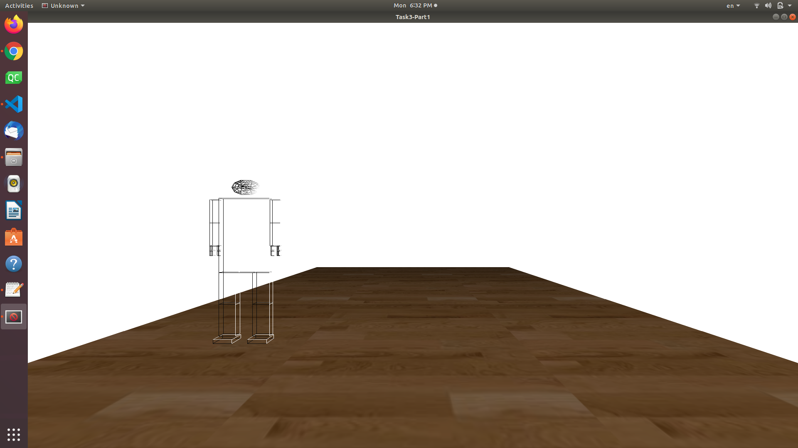
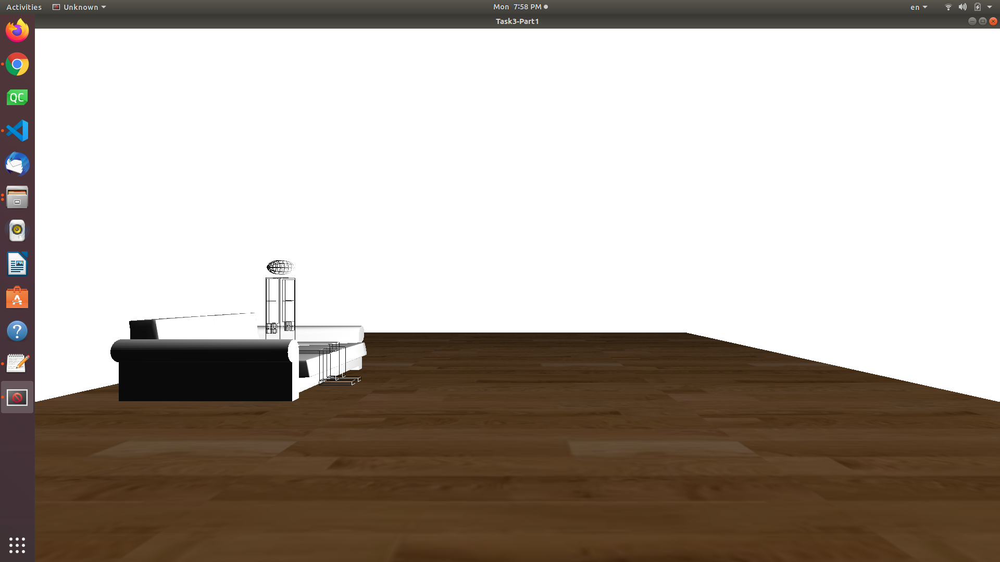
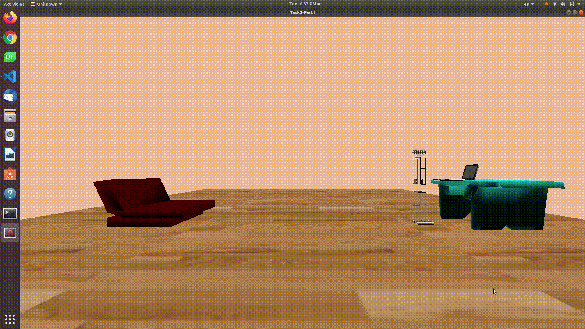
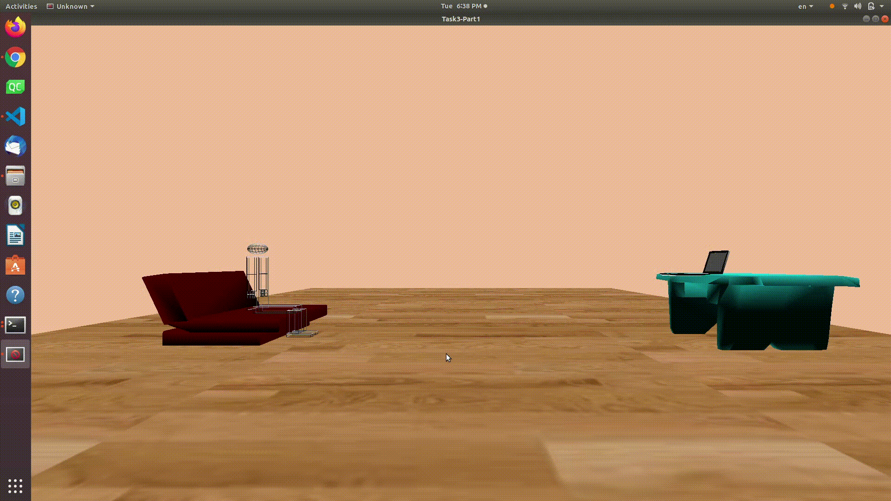

<h1 style="text-align: center;"> Full-Scene-Animation Project</h1>
<h3 style="text-align: center;"> Submitted to: Dr. Khaled Sayed</h3>
<h3 style="text-align: center;"> 2020 - 2021</h3>
<h4 style="text-align: center;"> Team ID: 02</h4>

## Team Members:

    1- Heba Elbeshbehsy 

    2- Radwa saeed Mohamady

    3- Tasneem Gamal

    4- Aya Ehab 

## To Compile the code open write in the terminal :
``` terminal
    g++ -o main main.cpp imageloader.cpp  glm.cpp -lGL -lglut -lGLU -lm
```   
* here we compile our main file in addition to source files of of our included files:<br>
<b>imageloader.cpp</b>  to read the bmp images used in texture mapping.</br>
<b>glm.cpp</b> to load the objects.
## To Run the code write in the terminal:
``` terminal
    ./main
```

<div style="page-break-after: always;"></div>
<h3> First of all we placed our previous implemented robot from task2 in our new floor :</h3>
<center></center>
<h3> Then we started to place different objects on this floor to interact with our mitionable robot  :</h3>
<center></center>
<h3> After that we applied different texture mapping to our floor and you can choose from them using right click menu </h3>
<h3> We also applied different types of light source (ambient, specular & diffuse ) and we colored the backgraund of our window display</h3>
<h3> Finally we made some animation functions to move the robot and make it interact with the object </h3>
<h4 style="text-align: center;"> Here you can see gifs of our project</h4>
<br>
<h3 style="text-align: center;"> Walking Animation</h3>
<center></center>
<br>
<h3 style="text-align: center;"> Interacting Animation</h3>
<center></center>
<br>
<h3 style="text-align: center;"> Texture Mapping</h3>
<center></center>
<br>
<h3 style="text-align: center;"> The Hole Scene</h3>
<center></center>
<br>

<h3 style="text-align: center;"> Some keyboard shortcuts "in addition to the brevious of the robot motions":</h3>

<center>

| Key |             Action             |
|:---:|:------------------------------:|
|  <kbd>m</kbd> | Walking Forward  |
|  <kbd>n</kbd> | object interaction |
|  <kbd>0</kbd> | Reset |
|  <kbd>+</kbd> | Backward |
| <kbd>-</kbd>  |  Forward |
<kbd>&larr;</kbd>| Turn Left |
|  <kbd>&rarr;</kbd>|  Turn Right|  
|  <kbd>&uarr;</kbd> | Turn Up |
| <kbd>&darr;</kbd>  |  Turn Down | 
|  <kbd>a</kbd> & <kbd>A</kbd> | Right Arm |
|  <kbd>w</kbd> & <kbd>W</kbd> | Right elbow |
|  <kbd>s</kbd> & <kbd>S</kbd> | Left arm |
|  <kbd>e</kbd> & <kbd>E</kbd> | Left elbow |
|  <kbd>d</kbd> & <kbd>D</kbd> | Right leg z |
|  <kbd>r</kbd> & <kbd>R</kbd> | Right knee z |
|  <kbd>f</kbd> & <kbd>F</kbd> | Left leg z |
|  <kbd>t</kbd> & <kbd>T</kbd> | Left knee z |
|  <kbd>z</kbd> & <kbd>Z</kbd> | Right knee x |
|  <kbd>x</kbd> & <kbd>X</kbd> | Right leg x |
|  <kbd>c</kbd> & <kbd>C</kbd> | Left leg x |
|  <kbd>v</kbd> & <kbd>V</kbd> | Left knee x |

</center>