# Medical Visualization

 ```
 
-Reading DICOM Images
-Two Modes of Visualization:
   1- Surface Rendering Mode
   2- Ray Casting Mode
   
 ```
 
 
 ```
 Surface Rendering Mode "Ankle"
 ```
 <table>
  <tr>
    <td>IS0 Value = 500</td>
    <td>IS0 Value = 900</td>
    <td>IS0 Value = 0</td>
  </tr>
  <tr>
    <td>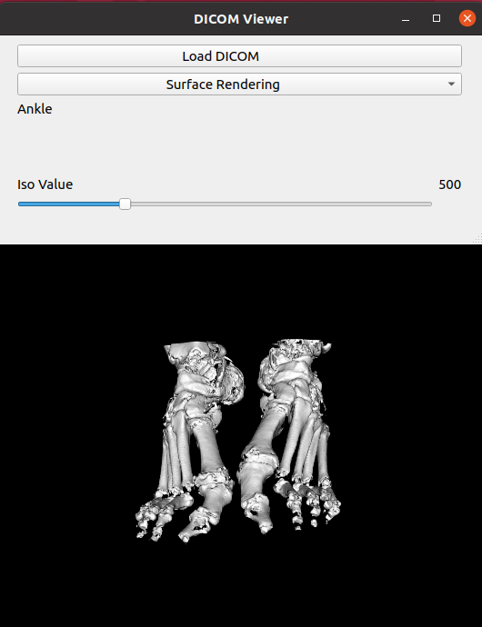</td>
    <td>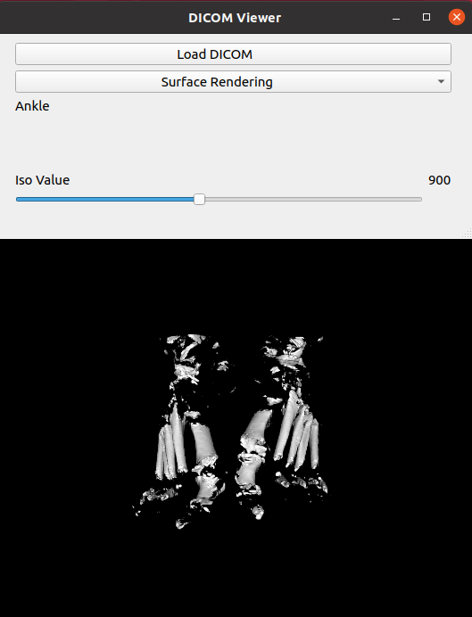</td>
    <td>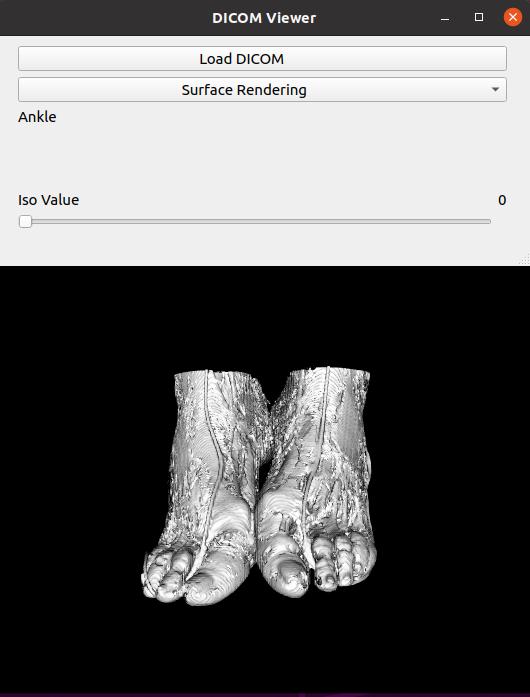</td>
  </tr>
 </table>
 
 
 
 ```
 Surface Rendering Mode "Head"
 ```
 <table>
  <tr>
    <td>IS0 Value = 249</td>
    <td>IS0 Value = 0</td>
    <td>IS0 Value = 1747</td>
  </tr>
  <tr>
    <td>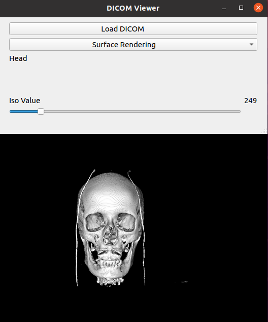</td>
    <td>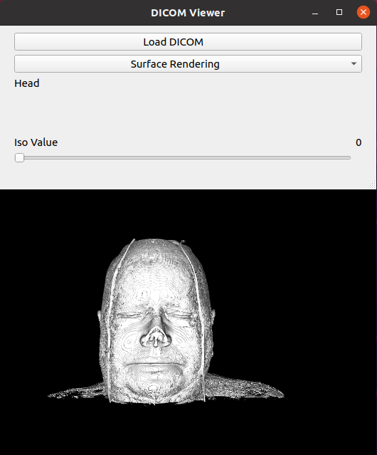</td>
    <td>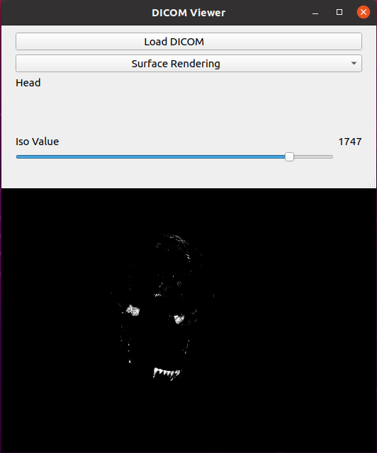</td>
  </tr>
 </table>


 ```
 Ray Casting Mode "Ankle"
 ```
 <table>
  <tr>
    <td>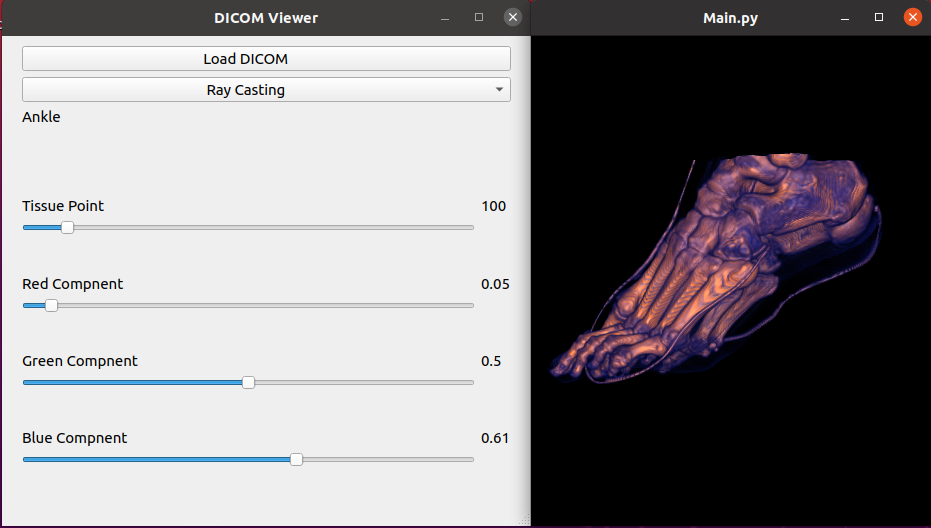</td>  
  </tr>
  <tr>
    <td>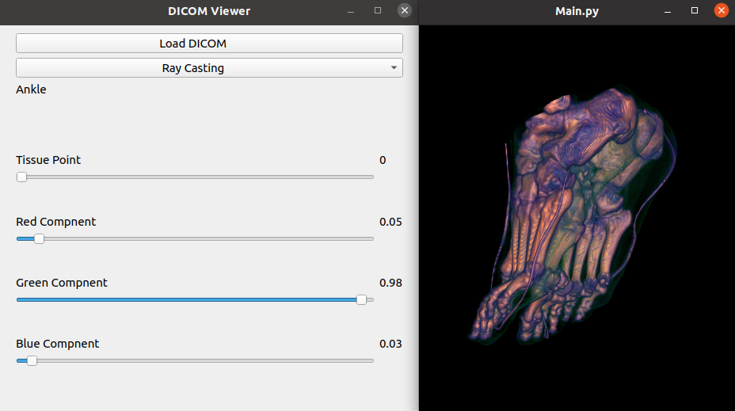</td>
  </tr>
  <tr>
    <td>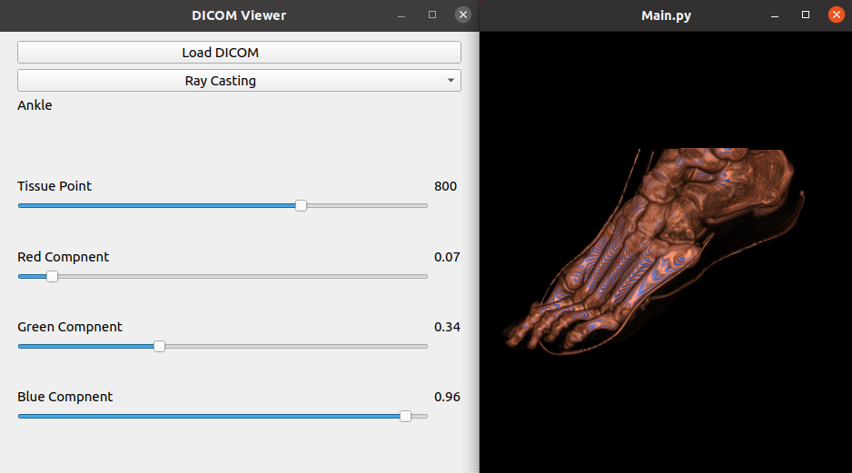</td>
  </tr>
  <tr>
    <td>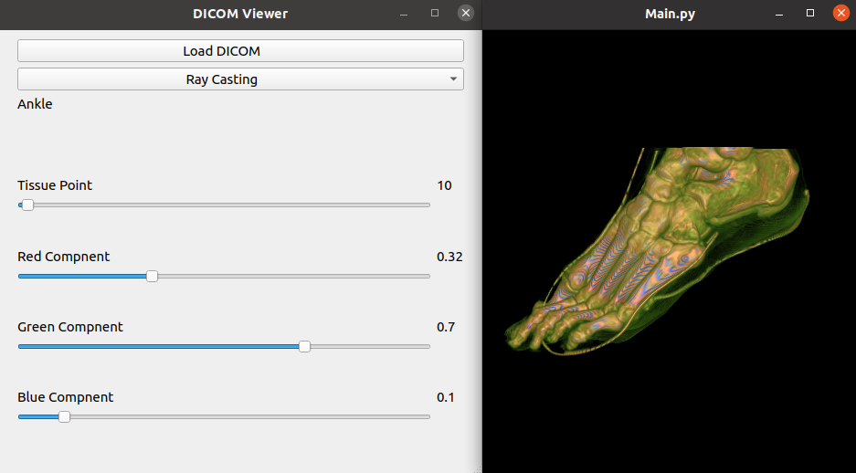</td>
  </tr>
 </table>

 ```
 Ray Casting Mode "Head"
 ```
 <table>
  <tr>
    <td>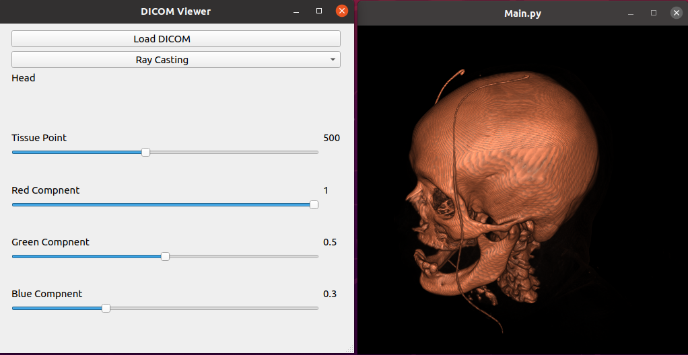</td>  
  </tr>
  <tr>
    <td>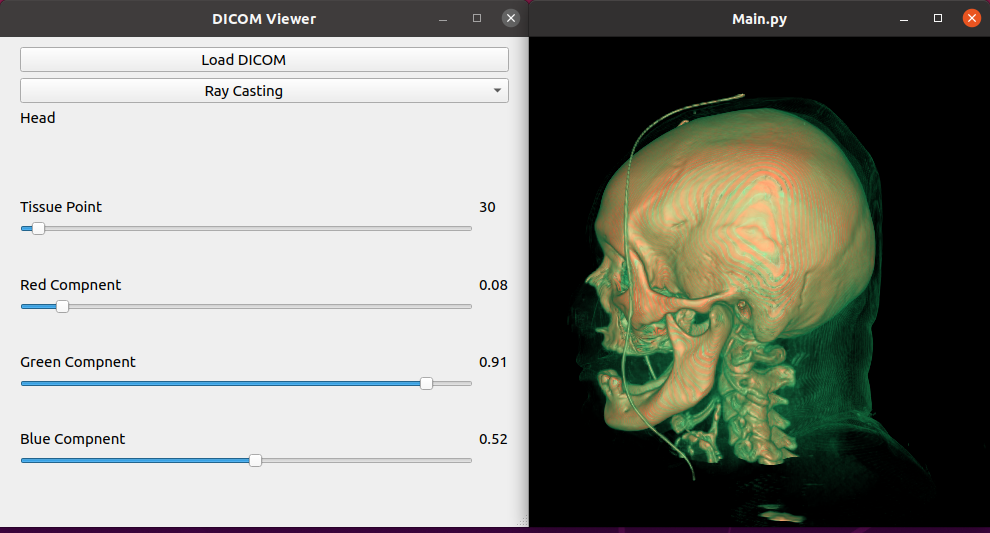</td>
  </tr>
 </table>
 
 
