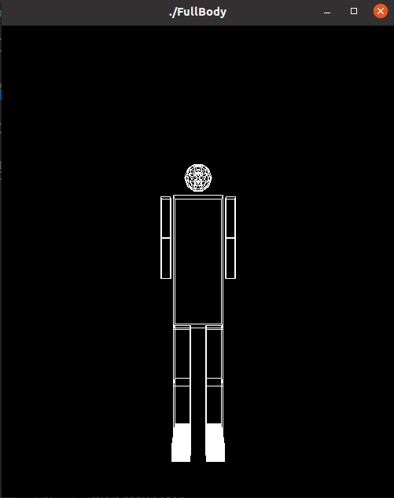
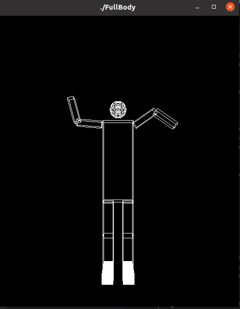
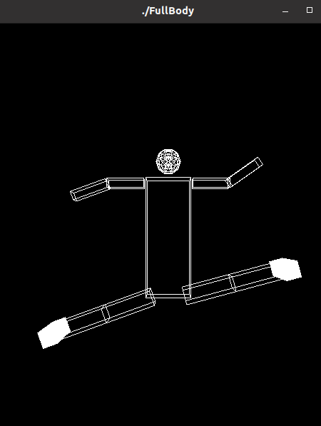
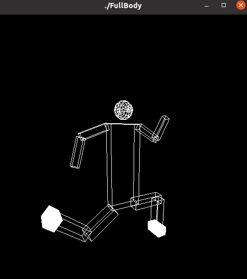
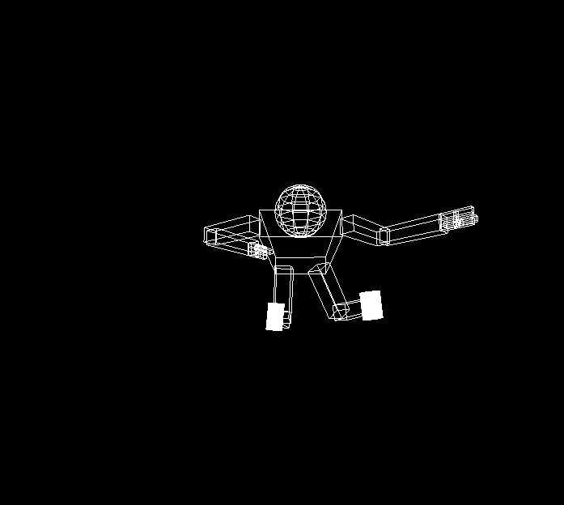
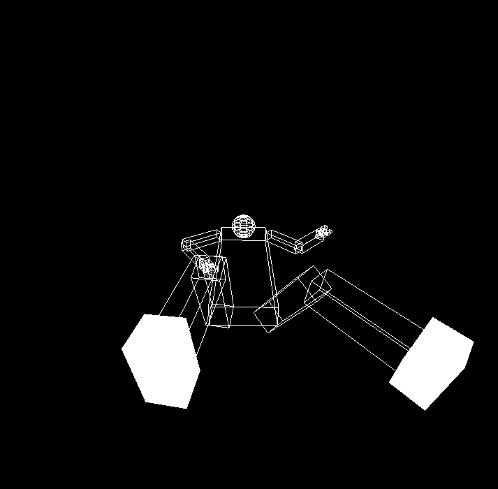
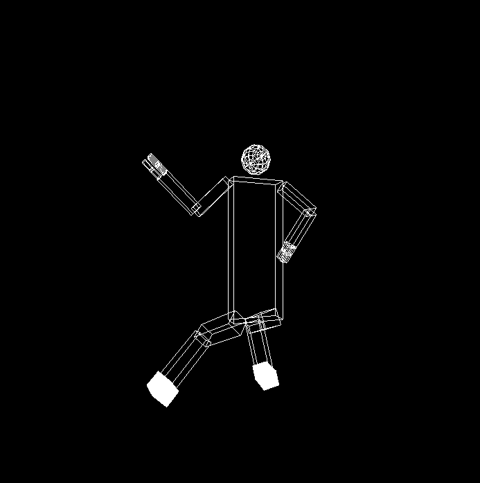

# SBE306B - Assignment 2 - Robot Body & Camera Movement
**Under the supervision of: [Eng. Ayman Anwar](https://github.com/A-M-Anwar) and [Eng. Eslam Adel](https://github.com/EslamAdel)**

## Team Members:

    1- Heba Elbeshbehsy 

    2- Aya Ehab 

    3- Tasneem Gamal

    4- Radwa saeed Mohamady

Here you can see the basic structure of the body 

Then we added the ability to move the arm and leg around z_axis.

We also enabled the lower to move around x-axis

Finally we added the fingers and here you can see different views of the body due to camera movement 

### Top View

### Buttom view

### Back and side View

Here are the shortcuts for movements

| Key |             Action             |
|:---:|:------------------------------:|
|  <kbd>0</kbd> | Reset |
|  <kbd>+</kbd> | Backward |
| <kbd>-</kbd>  |  Forward |
<kbd>&larr;</kbd>| Turn Left |
|  <kbd>&rarr;</kbd>|  Turn Right|  
|  <kbd>&uarr;</kbd> | Turn Up |
| <kbd>&darr;</kbd>  |  Turn Down | 
|  <kbd>a</kbd> & <kbd>A</kbd> | Right Arm |
|  <kbd>w</kbd> & <kbd>W</kbd> | Right elbow |
|  <kbd>s</kbd> & <kbd>S</kbd> | Left arm |
|  <kbd>e</kbd> & <kbd>E</kbd> | Left elbow |
|  <kbd>d</kbd> & <kbd>D</kbd> | Right leg z |
|  <kbd>r</kbd> & <kbd>R</kbd> | Right knee z |
|  <kbd>f</kbd> & <kbd>F</kbd> | Left leg z |
|  <kbd>t</kbd> & <kbd>T</kbd> | Left knee z |
|  <kbd>z</kbd> & <kbd>Z</kbd> | Right knee x |
|  <kbd>x</kbd> & <kbd>X</kbd> | Right leg x |
|  <kbd>c</kbd> & <kbd>C</kbd> | Left leg x |
|  <kbd>v</kbd> & <kbd>V</kbd> | Left knee x |
          
