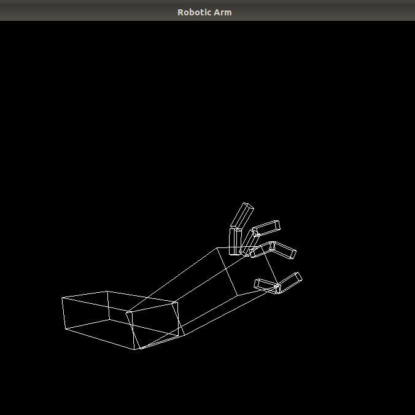
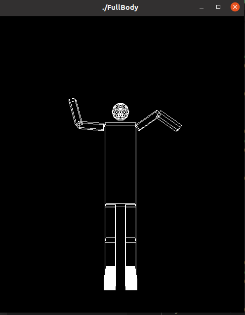

# Graphics-OpenGL
* [Task1 (Robot Arm)](https://github.com/Radwa-Saeed/Graphics-OpenGL/tree/main/Robot_Arm)

* [Task2 (FullBody Robot & Camera Movement)](https://github.com/Radwa-Saeed/Graphics-OpenGL/tree/main/FullBody%26Camera_Movement)

* [Task3-Part1(Animation,Texture Mapping & Rendering](https://github.com/Radwa-Saeed/Graphics-OpenGL/tree/main/Animation%20%26%20Rendering/Part1)

* [Task3-Part2(Medical Visualization](https://github.com/Radwa-Saeed/Graphics-OpenGL/tree/main/Animation%20%26%20Rendering/Part2)

<table>
  <tr>
    <td></td>  
  </tr>
  <tr>
    <td></td>
  </tr>
 </table>
