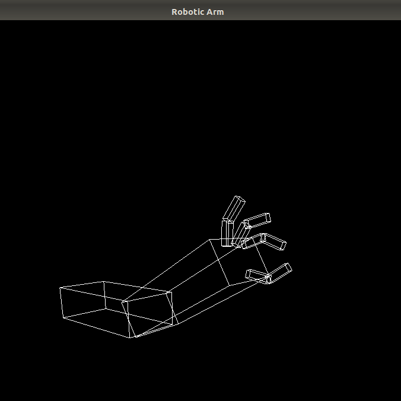
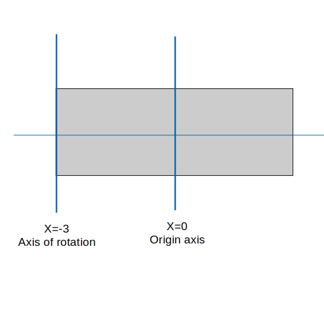
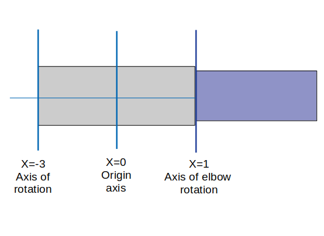
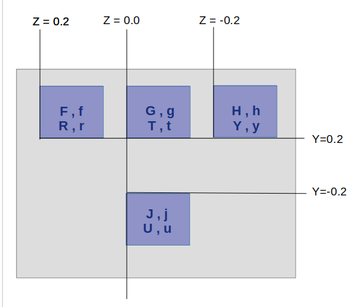
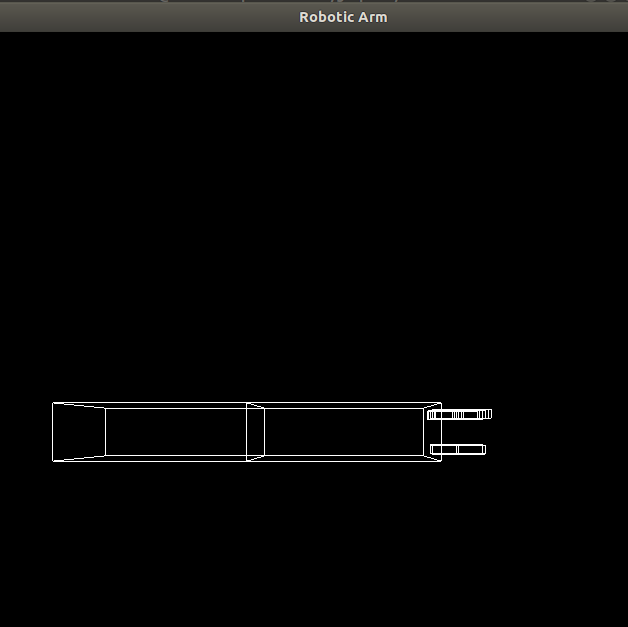
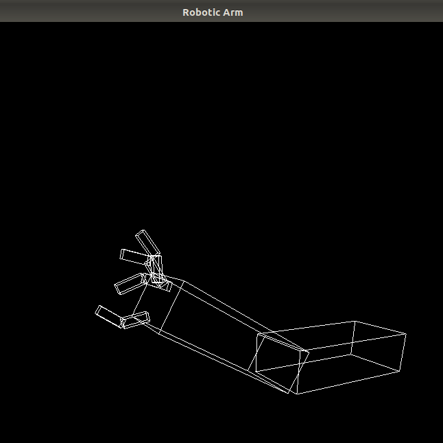

# SBE306B - Assignment 1 - Robot Arm
**Under the supervision of: [Eng. Ayman Anwar](https://github.com/A-M-Anwar) and [Eng. Eslam Adel](https://github.com/EslamAdel)**

In this assignment, we are asked to design using OpenGL - C++ a robot arm with the addition of animation repersented in rotations using keyboard.

### 1. The Arm:
Our robot arm consists of three main parts; shoulder, elbow, fingers. 

<center></center>

The shoulder have the ability to rotate freely 360&deg; around its joint. Elbow and its limb is rotating up to 150&deg; and down to 0&deg; in straight with the shoulder limb. For fingers, each consists of a metacarpal and a  phalange . The metacarpals rotate up to 60&deg; and down to -90&deg; and the distal phalanges only rotate internally down to -90&deg;. 


### 2. ```main``` function
The main function is:
```cpp
int main(int argc, char **argv)
{
   /* Basics in Building */
    glutInit(&argc, argv);
    glutInitDisplayMode(GLUT_DOUBLE | GLUT_RGB);
    glutInitWindowSize(900, 800);
    glutInitWindowPosition(100, 100);
    glutCreateWindow("Robotic Arm"); /* To Give the window title */

    init();
    glutMouseFunc(mouse);
    glutMotionFunc(motion);
    glutDisplayFunc(display);
    glutReshapeFunc(reshape);
    glutKeyboardFunc(keyboard);
    glutMainLoop();
    return 0;
}
```
* ```glutInitDisplayMode(GLUT_DOUBLE | GLUT_RGB);``` activates the RGB and double buffering bits to use the RGB systems and the 2 buffers to make our animation smoother and faster.
* ```glutDisplayFunc(display);``` will show all of our drawings implemented in the ```display``` function.
* ```glutKeyboardFunc(keyboard);``` will allow the events triggered from keyboard buttons activated to do some actions, to rotate our objects, depending the cases implemented in ```keyboard``` function.
* ```glutMainLoop();``` leaves the control and looping of window displaying to GLUT.
  

### 3. Shoulder
<center></center>

* First we will create our cube "shoulder":
```cpp
void display(){
    // Another blocks of code will be added later here.
    glPushMatrix();
    gglScalef (2.0, 0.6, 1.0);// 2* X, 0.6* Y, 1.0* Z
    glutSolidCube (1.0); // Drawing Cube with 1 in all dimensions.
    // Dimensions will be modified in the glScalef
    // Now, L(x) = 2, W(z) = 1.0, H(y) = 0.6 
    glPopMatrix();
}
```
* Now, we want to rotate the shoulder around the most distant line x = -3 . (SHOWN IN FIG).
* So, we will translate our object 1 in  +x - direction and rotate the object with an angle ```shoulder``` the inverse the translation with 1 in -x - direction.
```cpp
static int shoulder = 0, elbow = 0;
// Remaining Variables
void display(){
    // All of arm is rotating around x = -3
    glTranslatef (-3.0, 0.0, 0.0);
    glRotatef ((GLfloat) shoulder, 0.0, 0.0, 1.0);
    glTranslatef (1.0, 0.0, 0.0);
    // Draw the limb
    // The shoulder is centered in origin and has 1, 1, 1 dimensions
    glPushMatrix();
    glScalef (2.0, 0.6, 1.0); 
    glutSolidCube (1.0);
    glPopMatrix();
}
```

* As mentioned above, our shoulder has the freedom of rotation around the joint (360&deg;). We will use `S` to rotate counter clockwise and `s` to to rotate clockwise.

```cpp
void keyboard(unsigned char key, int x, int y)
{
    switch (key)
    {
        case 's':
            shoulder = (shoulder + 5) % 360;
            glutPostRedisplay();
            break;
        case 'S':
            shoulder = (shoulder - 5) % 360;
            glutPostRedisplay();
            break;

        // Other cases will be added later...
    }
}
```

### 4. Elbow:
<center></center>

* The elbow will rotate around x = 1. Because the elbow is first drawn in the origin, we will translate it with 1 in +x - direction and rotate it with angle ```elbow``` and now we will translate it another 1 in +ve x - direction as the elbow axis of rotation is the nearest end of the shoulder cube. Of course, the rotation of the shoulder will also applied to the elbow and that's why the rotation of shoulder is being popped of the stack before drawing the elbow cube

```cpp
void display(){
    // Whole arm rotation
    // All of arm is rotating around x = -1
    glTranslatef (-3.0, 0.0, 0.0);
    glRotatef ((GLfloat) shoulder, 0.0, 0.0, 1.0);
    glTranslatef (1.0, 0.0, 0.0);


    // Draw the limb
    // The shoulder is centered in origin and has 1, 1, 1 dimensions
    glPushMatrix();
    glScalef (2.0, 0.6, 1.0);
    glutSolidCube (1.0);
    glPopMatrix();


    // Elbow and below rotation
    // When the elbow first drawn, it is rotated around x = -3
    // But then shifted in X by 1
    glTranslatef (1.0, 0.0, 0.0);
    glRotatef ((GLfloat) elbow, 0.0, 0.0, 1.0);
    glTranslatef (1.0, 0.0, 0.0);

    // Drawing the elbow
    glPushMatrix();
    glScalef (2.0, 0.6, 1.0);
    glutSolidCube (1.0);
    glPopMatrix();
}
```

* For the rotation of the elbow, we have limitations as the elbow will not rotate more than 150&deg; and won't rotate downwards. For flexion we will use `e` and for extension we will use `E`.
```cpp
void keyboard(unsigned char key, int x, int y)
{
    switch (key)
    {
        case 'S':
            shoulder = (shoulder + 5) % 360;
            glutPostRedisplay();
            break;
        case 's':
            shoulder = (shoulder - 5) % 360;
            glutPostRedisplay();
            break;
        case 'e':
            if (elbow < 150)
            {
                elbow = (elbow + 5) % 360;
                glutPostRedisplay();
            }
            break;

        case 'E':
            if (elbow > 0)
            {
                elbow = (elbow - 5) % 360;
                glutPostRedisplay();
            }
            break;
    }
}
```

### 4. Fingers
<center></center>

* The above figure shows the coordinates of each finger of the 5 fingers. These corrdinates will be translated into when moving the fingers. For the rotation of the fingers , the metacarpals rotate with angle ```fingerBase[No.]``` up to 60° and down to -90° and the distal phalanges only rotate with angle ```fingerUp[No.]``` internally down to -90°
```cpp
// Our final display()
void display(void)
{
   glClear(GL_COLOR_BUFFER_BIT);
   glPushMatrix();
   glRotatef(angle2, 1.0, 0.0, 0.0);
   glRotatef(angle, 0.0, 1.0, 0.0);
   // Whole arm rotation
   // All of arm is rotating around x = -3
   glTranslatef (-3.0, 0.0, 0.0);
   glRotatef ((GLfloat) shoulder, 0.0, 0.0, 1.0);
   glTranslatef (1.0, 0.0, 0.0);
   //Draw the shoulder centered at origin has x=2, y=0.6, z=1
   //where x => width , y => hight , z => depth 
   glPushMatrix();
   glScalef (2.0, 0.6, 1.0); /* modeling transformation */
   glutWireCube (1.0);  /*  draw the cube */
   glPopMatrix();

   // Elbow and below rotation
   // When the elbow first drawn, it is rotated around x = -3
   // But then shifted in X by 1
   glTranslatef (1.0, 0.0, 0.0);
   glRotatef ((GLfloat) elbow, 0.0, 0.0, 1.0);
   glTranslatef (1.0, 0.0, 0.0);
   //Drawing the elbow
   glPushMatrix();
   glScalef (2.0, 0.6, 1.0);
   glutWireCube (1.0);
   glPopMatrix();  
   
   //Finger 1
   glPushMatrix();
      // Rotation of finger base 1
      glTranslatef(1.0, 0.2, 0.0); 
      glRotatef((GLfloat)fingerBase1, 0.0, 0.0, 1.0);
      glTranslatef(0.15, 0.0, 0.0);
      // Draw finger base 1
      glPushMatrix();
      glTranslatef(0.0, 0.0, 0.2); // base1 coordinates
      glScalef(0.3, 0.1, 0.1);
      glutWireCube(1);
      glPopMatrix();
      //Rotation of finger flang 1
      glTranslatef(0.15, 0.0, 0.0);
      glRotatef((GLfloat)fingerUp1, 0.0, 0.0, 1.0);
      glTranslatef(0.15, 0.0, 0.0);
      //Draw finger flang 1 
      glPushMatrix();
      glTranslatef(0.0, 0.0, 0.2); // up1 coordinates
      glScalef(0.3, 0.1, 0.1);
      glutWireCube(1);
      glPopMatrix();
   glPopMatrix();

   //Finger 2
   glPushMatrix();
      // Rotation of finger base 2
      glTranslatef(1.0, 0.2, 0.0); 
      glRotatef((GLfloat)fingerBase2, 0.0, 0.0, 1.0);
      glTranslatef(0.15, 0.0, 0.0);
      // Draw finger base 2
      glPushMatrix();
      glTranslatef(0.0, 0.0, 0.0); // base2 coordinates
      glScalef(0.3, 0.1, 0.1);
      glutWireCube(1);
      glPopMatrix();
      //Rotation of finger flang 2
      glTranslatef(0.15, 0.0, 0.0);
      glRotatef((GLfloat)fingerUp2, 0.0, 0.0, 1.0);
      glTranslatef(0.15, 0.0, 0.0);
      //Draw finger flang 2 
      glPushMatrix();
      glTranslatef(0.0, 0.0, 0.0); // up2 coordinates
      glScalef(0.3, 0.1, 0.1);
      glutWireCube(1);
      glPopMatrix();
   glPopMatrix();

   //Finger 3
   glPushMatrix();
      // Rotation of finger base 3
      glTranslatef(1.0, 0.2, 0.0); 
      glRotatef((GLfloat)fingerBase3, 0.0, 0.0, 1.0);
      glTranslatef(0.15, 0.0, 0.0);
      // Draw finger base 3
      glPushMatrix();
      glTranslatef(0.0, 0.0, -0.2); // base3 coordinates
      glScalef(0.3, 0.1, 0.1);
      glutWireCube(1);
      glPopMatrix();
      //Rotation of finger flang 3
      glTranslatef(0.15, 0.0, 0.0);
      glRotatef((GLfloat)fingerUp3, 0.0, 0.0, 1.0);
      glTranslatef(0.15, 0.0, 0.0);
      //Draw finger flang 3
      glPushMatrix();
      glTranslatef(0.0, 0.0, -0.2); // up3 coordinates
      glScalef(0.3, 0.1, 0.1);
      glutWireCube(1);
      glPopMatrix();
   glPopMatrix();

   //Finger 4
   glPushMatrix();
      // Rotation of finger base 4
      glTranslatef(1.0, -0.2, 0.0); 
      glRotatef((GLfloat)fingerBase4, 0.0, 0.0, 1.0);
      glTranslatef(0.15, 0.0, 0.0);
      // Draw finger base 4
      glPushMatrix();
      glTranslatef(0.0, 0.0, 0.0); // base4 coordinates
      glScalef(0.3, 0.1, 0.1);
      glutWireCube(1);
      glPopMatrix();
      //Rotation of finger flang 4
      glTranslatef(0.15, 0.0, 0.0);
      glRotatef((GLfloat)fingerUp4, 0.0, 0.0, 1.0);
      glTranslatef(0.15, 0.0, 0.0);
      //Draw finger flang 4
      glPushMatrix();
      glTranslatef(0.0, 0.0, 0.0); // up4 coordinates
      glScalef(0.3, 0.1, 0.1);
      glutWireCube(1);
      glPopMatrix();
   glPopMatrix();

   glPopMatrix();
   glutSwapBuffers();
}

```


* For keyboard actions, the above figure shows the keys of the flexion of the phalanges and the uppercase of them cause the extension. And for the metacarpals, we will use the keys below those, displayed in the figure, on our keyboard.

```cpp
// Used variables
static int shoulder = 0, elbow = 0;
static int fingerBase1 = 0, fingerUp1 = 0;
static int fingerBase2 = 0, fingerUp2 = 0;
static int fingerBase3 = 0, fingerUp3 = 0;
static int fingerBase4 = 0, fingerUp4 = 0;
static int fingerBase5 = 0, fingerUp5 = 0;


// Our final keyboard function
void keyboard(unsigned char key, int x, int y)
{
   switch (key)
   {
   case 'S':
      shoulder = (shoulder + 5) % 360;
      glutPostRedisplay();
      break;
   case 's':
      shoulder = (shoulder - 5) % 360;
      glutPostRedisplay();
      break;
   case 'e':
      if (elbow < 150)
            {
                elbow = (elbow + 5);
                glutPostRedisplay();
            }
            break;
   case 'E':
      if (elbow > 0)
            {
                elbow = (elbow - 5);
                glutPostRedisplay();
            }
            break;
   // FINGER 1
   //Base 1
   case 'F':
      if (fingerBase1 < 60) {
            fingerBase1 = (fingerBase1 + 5);
            glutPostRedisplay();
      }
      break;
   case 'f':
      if (fingerBase1 > -90) {
            fingerBase1 = (fingerBase1 - 5);
            glutPostRedisplay();
      }
      break;
   //up 1   
   case 'R':
      if (fingerUp1 < 0) {
            fingerUp1 = (fingerUp1 + 5);
            glutPostRedisplay();
      }
      break;
   case 'r':
      if (fingerUp1 > -90) {
            fingerUp1 = (fingerUp1 - 5);
            glutPostRedisplay();
      }
      break;

   // FINGER 2
   //base 2
   case 'G':
      if (fingerBase2 < 60) {
            fingerBase2 = (fingerBase2 + 5);
            glutPostRedisplay();
      }
      break;
   case 'g':
      if (fingerBase2 > -90) {
            fingerBase2 = (fingerBase2 - 5);
            glutPostRedisplay();
      }
      break;
   //up 2   
   case 'T':
      if (fingerUp2 < 0) {
            fingerUp2 = (fingerUp2 + 5);
            glutPostRedisplay();
      }
      break;
   case 't':
      if (fingerUp2 > -90) {
            fingerUp2 = (fingerUp2 - 5);
            glutPostRedisplay();
      }
      break;

   // FINGER 3
   //base 3
   case 'H':
      if (fingerBase3 < 60) {
            fingerBase3 = (fingerBase3 + 5);
            glutPostRedisplay();
      }
      break;
   case 'h':
      if (fingerBase3 > -90) {
            fingerBase3 = (fingerBase3 - 5);
            glutPostRedisplay();
      }
      break;
   //up 3
   case 'Y':
      if (fingerUp3 < 0) {
            fingerUp3 = (fingerUp3 + 5);
            glutPostRedisplay();
      }
      break;
   case 'y':
      if (fingerUp3 > -90) {
            fingerUp3 = (fingerUp3 - 5);
            glutPostRedisplay();
      }
      break;
   // FINGER 4
   //base 4
   case 'j':
      if (fingerBase4 < 90) {
            fingerBase4 = (fingerBase4 + 5);
            glutPostRedisplay();
      }
      break;
   case 'J':
      if (fingerBase4 > -60) {
            fingerBase4 = (fingerBase4 - 5);
            glutPostRedisplay();
      }
      break;
   // up 4   
   case 'u':
      if (fingerUp4 < 90) {
            fingerUp4 = (fingerUp4 + 5);
            glutPostRedisplay();
      }
      break;
   case 'U':
      if (fingerUp4 > 0) {
            fingerUp4 = (fingerUp4 - 5);
            glutPostRedisplay();
      }
      break;   

   case 27:
      exit(0);
      break;
   default:
      break;
   }
}

```
* Here you find the final result
<center></center>
<center></center>
<center></center>


